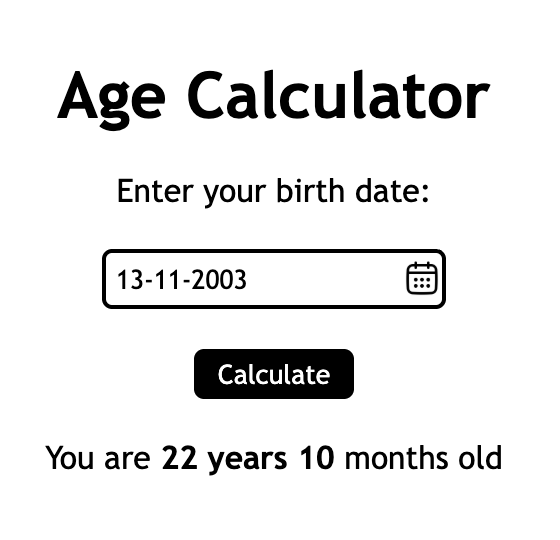

# Age Calculator

A simple, responsive age calculator built with HTML, CSS, and JavaScript. Enter your birth date, click **Calculate**, and the app shows your age on the same page. Date handling is done with [Luxon](https://www.npmjs.com/package/luxon).

This project is a solution to the [Age Calculator](https://roadmap.sh/projects/age-calculator) challenge on roadmap.sh, which focuses on learning how to use external packages from [npm](https://www.npmjs.com/) and how to work with dates in JavaScript.

## Preview



## Features

- Birth date input in `DD-MM-YYYY` format
- Age calculation powered by Luxon
- Result displayed on the same page after clicking **Calculate**
- Basic validation that shows an `Invalid Date` message for empty or out-of-range input
- Clean, minimal, responsive layout

## Tech Stack

| Technology | Purpose |
| ---------- | ------- |
| HTML5 | Page structure |
| CSS3 | Styling and layout (Flexbox) |
| JavaScript (ES6) | Logic, DOM manipulation, validation |
| [Luxon](https://www.npmjs.com/package/luxon) v3.7.2 | Date and time calculations (loaded via CDN) |

## Project Structure

```
Age-Calculator/
├── images/
│   ├── calendar.png    # Calendar icon used next to the input
│   └── preview.png     # Screenshot used in this README
├── index.html          # Markup
├── style.css           # Styles
├── script.js           # Age calculation and validation logic
└── README.md
```

## Getting Started

### Prerequisites

You only need a modern web browser. No build step is required, since Luxon is loaded from the jsDelivr CDN.

### Run Locally

1. Clone the repository:
   ```bash
   git clone https://github.com/KunalGuhagarkar/Age-Calculator.git
   ```
2. Move into the project folder:
   ```bash
   cd Age-Calculator
   ```
3. Open `index.html` in your browser, or serve it with a local server such as the VS Code Live Server extension.

Make sure a `calendar.png` icon exists inside the `images/` folder, as `index.html` references it.

## How It Works

1. The user types their birth date in `DD-MM-YYYY` format.
2. On clicking **Calculate**, the script splits the input into day, month, and year.
3. Luxon's `DateTime` is used to work out the difference between today and the entered date.
4. The input is validated (month between 1 and 12, day between 1 and 31, year not in the future).
5. The result, or an `Invalid Date` message, is shown in the output container below the form.

## Usage Example

| Input | Output |
| ----- | ------ |
| `15-06-2000` | `You are 26 years 3 months old` (varies by today's date) |
| *(empty)* | `Invalid Date` |
| `45-13-2000` | `Invalid Date` |

## Requirements Checklist

- [x] Form for entering a birth date
- [x] Luxon used for date calculations
- [x] Result displayed on the same page after submission
- [x] Basic input validation
- [x] Simple, responsive styling

## Possible Improvements

- Integrate `js-datepicker` and install it through npm so the calendar icon opens a real date picker
- Use Luxon's `diff()` with `["years", "months", "days"]` for a more accurate age breakdown
- Use Luxon's `DateTime.fromFormat(input, "dd-MM-yyyy")` and its `isValid` property for stricter validation, such as catching dates like `31-02-2000`
- Prevent future dates from being selected
- Add keyboard support, so pressing Enter triggers the calculation
- Add accessibility improvements such as labels and ARIA live regions for the result

## Contributing

Suggestions and feedback are welcome. Feel free to open an issue or submit a pull request on the [GitHub repository](https://github.com/KunalGuhagarkar/Age-Calculator).

## Links

- **Repository:** [github.com/KunalGuhagarkar/Age-Calculator](https://github.com/KunalGuhagarkar/Age-Calculator)
- **Challenge:** [roadmap.sh/projects/age-calculator](https://roadmap.sh/projects/age-calculator)

## Author

**Kunal Guhagarkar**

- GitHub: [@KunalGuhagarkar](https://github.com/KunalGuhagarkar)